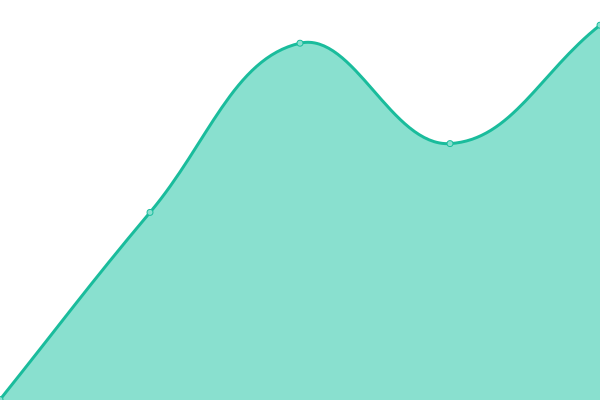

# [📈 Live Status](https://status.ronkkeli.net): <!--live status--> **🟧 Partial outage**

This repository contains the open-source uptime monitor and status page for [Ronkkeli](https://status.ronkkeli.net), powered by [Upptime](https://github.com/upptime/upptime).

With [Upptime](https://upptime.js.org), you can get your own unlimited and free uptime monitor and status page, powered entirely by a GitHub repository. We use [Issues](https://github.com/ronkkeli/upptime/issues) as incident reports, [Actions](https://github.com/ronkkeli/upptime/actions) as uptime monitors, and [Pages](https://status.ronkkeli.net) for the status page.

<!--start: status pages-->
<!-- This summary is generated by Upptime (https://github.com/upptime/upptime) -->
<!-- Do not edit this manually, your changes will be overwritten -->
<!-- prettier-ignore -->
| URL | Status | History | Response Time | Uptime |
| --- | ------ | ------- | ------------- | ------ |
|  [Game-Panel](https://panel.ronkkeli.net) | 🟩 Up | [game-panel.yml](https://github.com/1Ronkkeli/upptime/commits/HEAD/history/game-panel.yml) | 

 681ms
     
 | 

<a href="https://status.ronkkeli.net/history/game-panel">100.00%</a>
    

|  [Customer Portal / Website](https://www.ronkkeli.com) | 🟥 Down | [customer-portal-website.yml](https://github.com/1Ronkkeli/upptime/commits/HEAD/history/customer-portal-website.yml) | 

 87ms
     
 | 

<a href="https://status.ronkkeli.net/history/customer-portal-website">4.77%</a>
    

<!--end: status pages-->

[**Visit our status website →**](https://status.ronkkeli.net)

## 📄 License

- Powered by: [Upptime](https://github.com/upptime/upptime)
- Code: [MIT](./LICENSE) © [Anand Chowdhary](https://anandchowdhary.com), supported by [Pabio](https://pabio.com)
- Data in the `./history` directory: [Open Database License](https://opendatacommons.org/licenses/odbl/1-0/)
