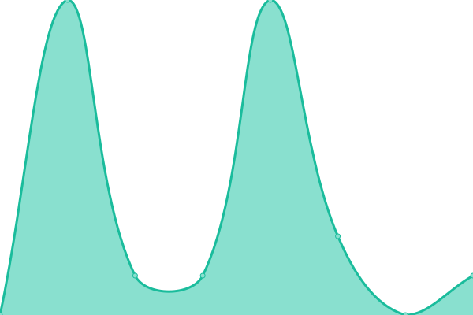
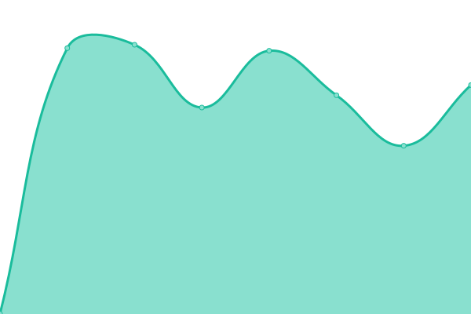
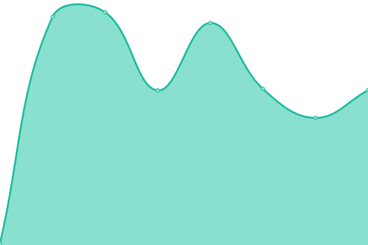
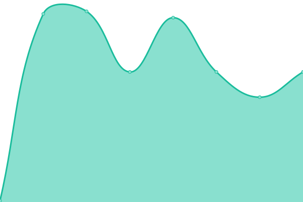
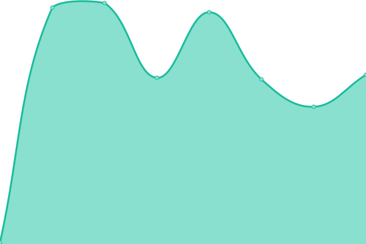
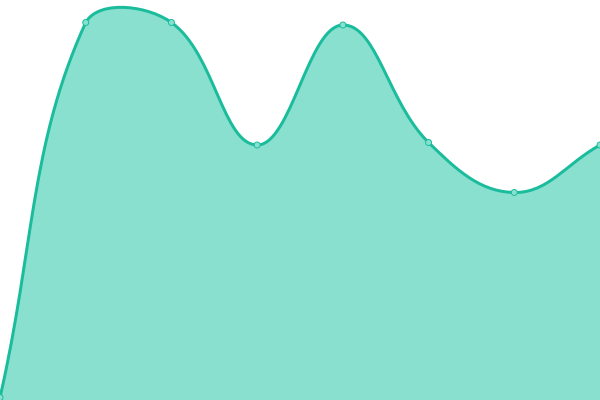
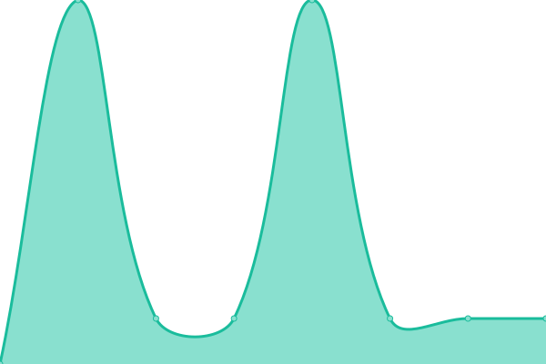

# [📈 Live Status](https://status.ronkkeli.net): <!--live status--> **🟧 Partial outage**

This repository contains the open-source uptime monitor and status page for [Ronkkeli](https://status.ronkkeli.net), powered by [Upptime](https://github.com/upptime/upptime).

With [Upptime](https://upptime.js.org), you can get your own unlimited and free uptime monitor and status page, powered entirely by a GitHub repository. We use [Issues](https://github.com/ronkkeli/upptime/issues) as incident reports, [Actions](https://github.com/ronkkeli/upptime/actions) as uptime monitors, and [Pages](https://status.ronkkeli.net) for the status page.

<!--start: status pages-->
<!-- This summary is generated by Upptime (https://github.com/upptime/upptime) -->
<!-- Do not edit this manually, your changes will be overwritten -->
<!-- prettier-ignore -->
| URL | Status | History | Response Time | Uptime |
| --- | ------ | ------- | ------------- | ------ |
|  [Game-Panel | Central Management For Gamehosting |](https://panel.ronkkeli.net) | 🟩 Up | [game-panel-central-management-for-gamehosting.yml](https://github.com/1Ronkkeli/upptime/commits/HEAD/history/game-panel-central-management-for-gamehosting.yml) | 

 612ms
     
 | 

<a href="https://status.ronkkeli.net/history/game-panel-central-management-for-gamehosting">100.00%</a>
    

|  [Game-Panel | BETA | | Non Public |](odyssey.panel.gg) | 🟩 Up | [game-panel-beta-non-public.yml](https://github.com/1Ronkkeli/upptime/commits/HEAD/history/game-panel-beta-non-public.yml) | 

 3ms
     
 | 

<a href="https://status.ronkkeli.net/history/game-panel-beta-non-public">100.00%</a>
    

|  [ronkkeli.com | Main Website | Customer/Billing portal |](https://www.ronkkeli.com) | 🟩 Up | [ronkkeli-com-main-website-customer-billing-portal.yml](https://github.com/1Ronkkeli/upptime/commits/HEAD/history/ronkkeli-com-main-website-customer-billing-portal.yml) | 

 645ms
     
 | 

<a href="https://status.ronkkeli.net/history/ronkkeli-com-main-website-customer-billing-portal">100.00%</a>
    

|  [Web-1 | SPANEL | Main Webhosting |](https://cloud-4b162c.managed-vps.net/hostpanel/login) | 🟩 Up | [web-1-spanel-main-webhosting.yml](https://github.com/1Ronkkeli/upptime/commits/HEAD/history/web-1-spanel-main-webhosting.yml) | 

 718ms
     
 | 

<a href="https://status.ronkkeli.net/history/web-1-spanel-main-webhosting">100.00%</a>
    

|  [Game1 | Minecraft + Other games |](game1.ronkkeli.net) | 🟩 Up | [game1-minecraft-other-games.yml](https://github.com/1Ronkkeli/upptime/commits/HEAD/history/game1-minecraft-other-games.yml) | 

 110ms
     
 | 

<a href="https://status.ronkkeli.net/history/game1-minecraft-other-games">100.00%</a>
    

|  [Game2 | FiveM |](game2.ronkkeli.net) | 🟩 Up | [game2-five-m.yml](https://github.com/1Ronkkeli/upptime/commits/HEAD/history/game2-five-m.yml) | 

 110ms
     
 | 

<a href="https://status.ronkkeli.net/history/game2-five-m">100.00%</a>
    

|  [Game3 | FiveM |](game3.ronkkeli.net) | 🟩 Up | [game3-five-m.yml](https://github.com/1Ronkkeli/upptime/commits/HEAD/history/game3-five-m.yml) | 

 116ms
     
 | 

<a href="https://status.ronkkeli.net/history/game3-five-m">100.00%</a>
    

|  [Game4 | Beta non public |](135.181.58.27) | 🟥 Down | [game4-beta-non-public.yml](https://github.com/1Ronkkeli/upptime/commits/HEAD/history/game4-beta-non-public.yml) | 

 134ms
     
 | 

<a href="https://status.ronkkeli.net/history/game4-beta-non-public">100.00%</a>
    

|  [Database Cloud Infrastructure | panel.ronkkeli.net |](phpmyadmin-gra3.hosting.ovh.net) | 🟩 Up | [database-cloud-infrastructure-panel-ronkkeli-net.yml](https://github.com/1Ronkkeli/upptime/commits/HEAD/history/database-cloud-infrastructure-panel-ronkkeli-net.yml) | 

 110ms
     
 | 

<a href="https://status.ronkkeli.net/history/database-cloud-infrastructure-panel-ronkkeli-net">100.00%</a>
    

|  [ronkkeli.net | Mail | Non Critical | Ticket Team Mails |](https://webmail.ronkkeli.net) | 🟩 Up | [ronkkeli-net-mail-non-critical-ticket-team-mails.yml](https://github.com/1Ronkkeli/upptime/commits/HEAD/history/ronkkeli-net-mail-non-critical-ticket-team-mails.yml) | 

 1355ms
     
 | 

<a href="https://status.ronkkeli.net/history/ronkkeli-net-mail-non-critical-ticket-team-mails">100.00%</a>
    

|  [ronkkeli.com | Mail | Billing/Panel + Other notifications | Main Company Emails |](mail.google.com) | 🟩 Up | [ronkkeli-com-mail-billing-panel-other-notifications-main-company-emails.yml](https://github.com/1Ronkkeli/upptime/commits/HEAD/history/ronkkeli-com-mail-billing-panel-other-notifications-main-company-emails.yml) | 

 3ms
     
 | 

<a href="https://status.ronkkeli.net/history/ronkkeli-com-mail-billing-panel-other-notifications-main-company-emails">100.00%</a>
    

|  [docs.ronkkeli.net | Documentation Platform |](https://docs.ronkkeli.net) | 🟩 Up | [docs-ronkkeli-net-documentation-platform.yml](https://github.com/1Ronkkeli/upptime/commits/HEAD/history/docs-ronkkeli-net-documentation-platform.yml) | 

 203ms
     
 | 

<a href="https://status.ronkkeli.net/history/docs-ronkkeli-net-documentation-platform">100.00%</a>
    

<!--end: status pages-->

[**Visit our status website →**](https://status.ronkkeli.net)

## 📄 License

- Powered by: [Upptime](https://github.com/upptime/upptime)
- Code: [MIT](./LICENSE) © [Anand Chowdhary](https://anandchowdhary.com), supported by [Pabio](https://pabio.com)
- Data in the `./history` directory: [Open Database License](https://opendatacommons.org/licenses/odbl/1-0/)
